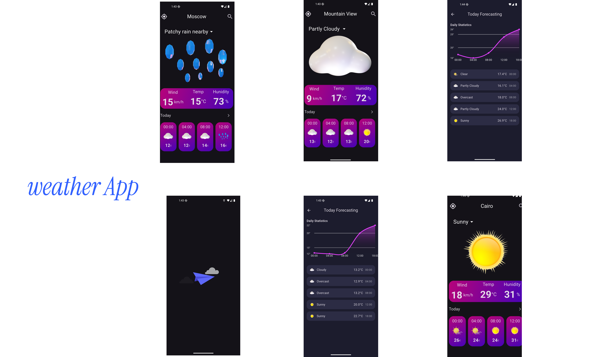

# 🌦️ Professional Weather App

A modern, visually rich weather application built with Flutter, offering accurate forecasts, elegant UI animations, and a powerful city-based search system.


---

## ✨ Key Features

- 🔍 **City-based weather search**
- 📈 **Graphical "Today Forecasting" view**
- 🌡️ Live temperature, wind, and humidity data
- 🌅 Smooth weather icon animations (sun, rain, cloud, etc.)
- 🌃 Full dark mode support
- 🚀 Beautiful loading transitions (e.g., animated paper plane)
- 🧭 Custom-designed cards for daily & hourly forecasts
- 💠 Weather data fetched via WeatherAPI (with location or city name)

---

## 📷 Screenshots

| Home View | Hourly Forecast | Today’s Graph |
|-----------|------------------|----------------|
|  

---


## 📂 Folder Structure

```plaintext
lib/
├── data/            # Data layer (models, Hive, repositories)
├── domain/          # Business logic (entities, usecases)
└── presentation/    # UI (screens, widgets, state management)
└── main.dart                # App entry point
```

## 🧰 Technologies Used

- [Flutter](https://flutter.dev/)
- [Dart](https://dart.dev/)
- [dio](https://pub.dev/packages/dio)
- [webview_flutter](https://pub.dev/packages/webview_flutter) 
- [News API](https://newsapi.org/)

### Prerequisites

- [Flutter SDK](https://flutter.dev/docs/get-started/install)
- Android Studio / VS Code
- An API key from [NewsAPI.org](https://newsapi.org/) 
## 🛠️ Getting Started

1. Clone the repository:
   ```bash
   git clone https://github.com/kareemAlfara/Weather-app.git
   cd NoteApp
   ```

2. Install dependencies:
   ```bash
   flutter pub get
   ```

3. Generate Hive type adapters :
   ```bash
   flutter packages pub run build_runner build
   ```

4. Run the app:
   ```bash
   flutter run
   ```

---

## 👤 Author

- [Kareem Alfarra](https://github.com/kareemAlfara/)
- LinkedIn: [linkedin.com/in/kareem-elfara](https://www.linkedin.com/in/kareem-elfara-2aa767337/)

---
